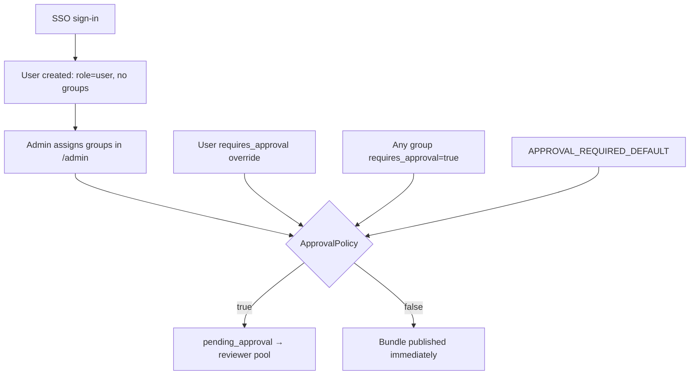

# Secure File Send

Organizational file sharing built on Laravel 12 — share files securely with colleagues and external recipients, similar to WeTransfer but self-hosted under your control.

Bundle and user metadata is stored in a **SQL database** (SQLite for local dev, MySQL/MariaDB for production). File binaries live on disk under `storage/content/`. Production deployments use **Microsoft SSO**, optional **approval workflows**, invitation/OTP recipient access, and an **admin panel** at `/admin`.

Each bundle provides two links:
- a **preview link** — recipients see bundle contents and can download as ZIP (e.g. `https://files.yourcompany.com/bundle/dda2d646b6746b96ea9b?auth=965242`)
- a **direct download link** — recipients download all files without preview (e.g. `https://files.yourcompany.com/bundle/dda2d646b6746b96ea9b/download?auth=965242`)

Both links share the same authorization code. A scheduled background task removes expired bundles every five minutes.

## Features

- **Microsoft SSO** (single-tenant Azure AD / Entra ID) for production
- **Roles and groups** — admin panel, reviewer approval queue, per-group upload policies
- **Approval workflow** — configurable per user or group before shares go out
- **Recipient access** — invitation links with OTP for internal and external email addresses
- **Admin panel** (`/admin`) — users, groups, bundles, branding, sharing defaults, audit log
- **bundle settings**: title, description, expiration date, max downloads, password
- upload one or more files via drag and drop or filesystem browse
- sharing link with bundle content preview
- download rate limiter
- ability to download the entire bundle as ZIP archive (password protected when applicable)
- direct download link (no preview)
- garbage collector removes expired bundles on a schedule
- multilingual (EN, FR, DE and KR)
- secured by tokens, authentication codes and non-publicly-accessible files

## Demo

### Online Demo

You may visit my [Online Demo](https://filesharing.webinno.fr/)

### Video Demo

A video demo is available [on Youtube](https://youtu.be/hO4tRaZa4N4)

### Screenshot


## Requirements

- PHP >= 8.3 with Ctype, OpenSSL, Mbstring, Tokenizer, XML, JSON, and ZipArchive extensions
- **Database**: SQLite (local dev) or MySQL/MariaDB (production, `utf8mb4`)
- **Mail**: outbound SMTP for invitations, OTP, and approval notifications
- **Queue worker** in production when `QUEUE_CONNECTION=database` (or `redis`)
- **Cron**: `php artisan schedule:run` every minute

Frontend libraries: Dropzone.js, Alpine.js, Tailwind CSS, Day.js, Axios.

## Enterprise deployment

Complete runbook for IT admins deploying to staging or production. Goal: another admin can operate this without tribal knowledge.

### Prerequisites

Before you start, confirm:

- [ ] HTTPS host and reverse proxy configured
- [ ] MySQL/MariaDB available (`utf8mb4` / `utf8mb4_unicode_ci`)
- [ ] Outbound SMTP tested (internal and external recipients)
- [ ] Entra ID app registration planned (single tenant)
- [ ] Cron job for `schedule:run` scheduled
- [ ] Persistent queue worker planned when `QUEUE_CONNECTION=database`
- [ ] Secrets stored in your org's secrets manager (document which Entra app owns prod vs staging)

### Azure app registration

Single-tenant Azure AD (Entra ID) sign-in. There is **no break-glass local admin** in production — see [First admin bootstrap](#first-admin-bootstrap).

1. Open [Microsoft Entra admin center](https://entra.microsoft.com/) → **App registrations** → **New registration**.
2. Name the app (e.g. "Secure File Send").
3. Supported account types: **Accounts in this organizational directory only (Single tenant)**.
4. Redirect URI — platform **Web**:
   ```
   https://files.yourcompany.com/auth/microsoft/callback
   ```
   Must match `APP_URL` exactly (including `https`, no trailing slash on the base URL).
5. Create the registration and copy these three values:
   - **Application (client) ID** → `AZURE_CLIENT_ID`
   - **Directory (tenant) ID** → `AZURE_TENANT_ID`
6. Under **Certificates & secrets**, create a **Client secret** → `AZURE_CLIENT_SECRET` (store the secret value, not the secret ID).
7. Under **API permissions**, ensure these delegated permissions are granted (admin consent if required):
   - `openid`
   - `profile`
   - `email`
   - `Microsoft Graph` → `User.Read`

> **Handoff note:** Document which Entra app registration owns each environment. Store `AZURE_CLIENT_SECRET` in your secrets manager, not in chat or email.

### Environment variables

Copy `.env.example` to `.env` and fill in values. Grouped by deployment relevance.

#### Required for production

| Group | Variables | Notes |
| ----- | --------- | ----- |
| App | `APP_KEY`, `APP_URL`, `APP_ENV=production`, `APP_DEBUG=false` | Generate key with `php artisan key:generate` |
| Database | `DB_CONNECTION=mysql`, `DB_HOST`, `DB_PORT`, `DB_DATABASE`, `DB_USERNAME`, `DB_PASSWORD` | See [Production database](#production-database) |
| SSO | `MICROSOFT_SSO_ENABLED=true`, `AZURE_CLIENT_ID`, `AZURE_CLIENT_SECRET`, `AZURE_TENANT_ID`, `AZURE_REDIRECT_URI`, `AZURE_ALLOWED_DOMAINS` | Redirect defaults to `{APP_URL}/auth/microsoft/callback` |
| Mail | `MAIL_MAILER`, `MAIL_HOST`, `MAIL_PORT`, `MAIL_USERNAME`, `MAIL_PASSWORD`, `MAIL_ENCRYPTION`, `MAIL_FROM_ADDRESS`, `MAIL_FROM_NAME` | Required for invitations, OTP, approval emails |
| Queue | `QUEUE_CONNECTION=database` (or `redis`) | Requires `jobs` table from migrations + running worker |

Minimal SSO block:

```env
MICROSOFT_SSO_ENABLED=true
AZURE_CLIENT_ID=your-application-client-id
AZURE_CLIENT_SECRET=your-client-secret
AZURE_TENANT_ID=your-directory-tenant-id
AZURE_REDIRECT_URI="${APP_URL}/auth/microsoft/callback"
AZURE_ALLOWED_DOMAINS=yourcompany.com
```

Also ensure `APP_URL` matches the URL users visit and leave `UPLOAD_LIMIT_IPS` empty when SSO is enforced.

#### Governance and policy

| Variable | Default | Purpose |
| -------- | ------- | ------- |
| `APPROVAL_REQUIRED_DEFAULT` | `false` | Fallback when user has no override and no group requires approval |
| `DEFAULT_SHARE_MODE` | `invitation` | `invitation` or `static_link` for new bundles |
| `AZURE_ALLOWED_DOMAINS` | — | Comma-separated allowed email domains |
| `INVITATION_LINK_DAYS` | `30` | Invitation link validity |
| `BRANDING_SHOW_CREDIT` | `true` | Footer credit; overridable in admin Branding settings |

#### Security and operations

| Variable | Default | Purpose |
| -------- | ------- | ------- |
| `SESSION_IDLE_TIMEOUT` | `60` | Minutes of inactivity before logout |
| `OAUTH_RATE_LIMIT_PER_MINUTE` | `10` | Microsoft OAuth callback throttle |
| `DOWNLOAD_RATE_LIMIT_PER_MINUTE` | `30` | Bundle preview/download throttle |
| `OTP_RATE_LIMIT_PER_HOUR` | `5` | OTP requests per recipient email |
| `OTP_ROUTE_RATE_LIMIT_PER_HOUR` | `30` | OTP route HTTP throttle |
| `AUDIT_RETENTION_DAYS` | `365` | Audit log retention (`0` = keep forever) |
| `AUDIT_EXPORT_DEFAULT_FORMAT` | `csv` | `csv` or `json` for audit exports |

#### Upload settings

| Variable | Description |
| -------- | ----------- |
| `UPLOAD_MAX_FILESIZE` | Max per-file size (also configure PHP `post_max_size`, `upload_max_filesize`, `memory_limit`) |
| `UPLOAD_MAX_FILES` | Max files per bundle |
| `UPLOAD_PREVENT_DUPLICATES` | Block duplicate files (`true` / `false`) |
| `UPLOAD_BLOCKED_EXTENSIONS` | Comma-separated blocked extensions (no dots); unset uses built-in default; overridable in admin Sharing settings |
| `HASH_MAX_FILESIZE` | Max size to hash for dedup checks |
| `LIMIT_DOWNLOAD_RATE` | Download throttle (e.g. `100K`, `1M`) |
| `UPLOAD_LIMIT_IPS` | IP whitelist when SSO disabled; **ignored when SSO enabled** |

See also [Configuration](#configuration) for locale, timezone, and other app settings.

### First-time server setup

Production frontend assets (`public/build/`) are committed to the repository, so standalone deploys do **not** require Node.js or `npm run build` on the server.

Run these steps in order on the application server:

```bash
composer install --no-dev --optimize-autoloader
cp .env.example .env          # fill in all required values (see above)
php artisan key:generate
php artisan migrate --force
php artisan storage:link      # required for admin branding logos
```

Then configure background processes:

1. **Cron** — every minute:
   ```
   * * * * * /usr/bin/php /path-to-your-project/artisan schedule:run >> /dev/null 2>&1
   ```
   Runs bundle purge (every 5 min), audit purge (daily), and other scheduled tasks.

2. **Queue worker** — keep a persistent process running (Supervisor or systemd recommended):
   ```bash
   php artisan queue:work --sleep=3 --tries=3
   ```
   For Docker, the image runs `queue:work --stop-when-empty` via cron each minute.

3. **Backups** — schedule regular backups of the MySQL database and `storage/content/` uploads.

**Upgrading from legacy Orbit installs:** if you previously used JSON flat-file storage, run `php artisan fs:migrate:orbit` once after `migrate` to import existing data.

### First admin bootstrap

There is no pre-seeded admin account and no break-glass local login in production.

1. Deploy the app and run migrations (see [First-time server setup](#first-time-server-setup)).
2. First operator signs in via **Sign in with Microsoft** at `/login`.
   - A user record is created automatically with the **`user` role only** and **no groups**.
3. On the server (requires shell access), promote the first admin:
   ```bash
   php artisan fs:user:list
   php artisan fs:user:promote you@yourcompany.com --role=admin
   php artisan fs:user:promote you@yourcompany.com --role=reviewer   # if they should receive approval emails
   ```
4. Sign in again and open `/admin` to assign roles, groups, and branding.
5. All subsequent role and group changes can be done in `/admin` or via CLI.

### Roles

Roles are **not synced from Entra groups**. Assign them manually in `/admin` or with Artisan.

| Role | Slug | Assigned via | Capabilities |
| ---- | ---- | ------------ | ------------ |
| User | `user` | Automatic on first SSO sign-in | Upload, manage own bundles |
| Reviewer | `reviewer` | Admin or CLI | `/approval` queue; **receives approval notification emails** |
| Admin | `admin` | Admin or CLI (bootstrap) | `/admin` Filament panel |

**Important nuances:**

- Roles are **additive** — every account always keeps `user`.
- **Admin can use the approval UI** even without the reviewer role, but **approval emails only go to users with the `reviewer` role**. Assign `reviewer` to anyone who should be notified of pending submissions.
- Suggested org pattern: 1–2 admins (platform owners), 2–3 reviewers (compliance/IT).

CLI reference:

```bash
php artisan fs:user:list
php artisan fs:user:promote email@company.com --role=reviewer
php artisan fs:user:revoke email@company.com --role=admin
```

### Groups and approval policy

**Groups are app-local policy buckets** — they are **not** synced from Azure AD / Entra group membership. After SSO sign-in, users have **no group** until an admin assigns one in `/admin`.



Each group controls two policies:

| Field | Effect |
| ----- | ------ |
| `requires_approval` | Uploaders in this group must get reviewer approval before links/invitations go out |
| `allow_static_links` | Members may use static-link share mode (less secure; invitation mode is default) |

**Seeded groups** (created by migrations/seeders):

| Slug | Approval required | Static links |
| ---- | ----------------- | ------------ |
| `default` | No | Allowed |
| `approval-required` | Yes | Not allowed |

**Approval policy resolution** (first match wins):

1. Per-user `requires_approval` override (if set on the user record) — wins
2. Any group the user belongs to with `requires_approval=true` — requires approval
3. Else `APPROVAL_REQUIRED_DEFAULT` env fallback

When approval is required, the bundle enters `pending_approval` status. Users in the **reviewer pool** (anyone with the `reviewer` role) are emailed and can approve or deny at `/approval`.

**Operator tasks:**

- Assign new users to a group promptly (e.g. `default` or `approval-required` per org policy)
- Use per-user approval override only for exceptions
- Manage membership in `/admin` → **Users** or **Groups**

### Admin panel

Admins manage the organization from `/admin` (Filament). Sign in with an account that has the `admin` role.

| Section | Purpose |
| -------- | -------- |
| **Users** | Search users; edit roles, group membership, and per-user approval override |
| **Groups** | Create/edit groups; toggle approval requirement and static-link policy; assign members |
| **Bundles** | View all shares with filters; revoke, extend expiry, or permanently delete |
| **Reviewers** | Read-only list of users in the reviewer pool |
| **Branding** | App name, logo, colors, footer text, and legal URLs (stored in DB; applied without redeploy) |
| **Sharing** | Default share mode (invitation vs static link) for new bundles |

Ensure `php artisan storage:link` has been run so uploaded logos are served from `public/storage`.

### Production database

SQLite works for local development. For production, use MySQL (or MariaDB):

```env
DB_CONNECTION=mysql
DB_HOST=127.0.0.1
DB_PORT=3306
DB_DATABASE=filesharing
DB_USERNAME=filesharing
DB_PASSWORD=your-secure-password
```

Recommended: charset/collation `utf8mb4` / `utf8mb4_unicode_ci`, dedicated DB user with minimal privileges, regular backups of DB + `storage/content/`.

### Queue workers

Mail (invitations, OTP, approval notifications) is queued for async delivery:

```env
QUEUE_CONNECTION=database   # or redis
```

Run migrations (includes `jobs` table), then start a worker (see [First-time server setup](#first-time-server-setup)).

### Ongoing operations

Day-2 admin checklist:

- Add or remove reviewers and admins (`/admin` or `fs:user:promote` / `fs:user:revoke`)
- Move users between groups as org policy changes
- Update branding and sharing defaults in `/admin`
- Monitor audit log and run exports as needed
- Verify queue worker and cron are running
- Back up MySQL and `storage/content/` on schedule
- Pre-production sign-off: run [docs/SMOKE_TEST.md](docs/SMOKE_TEST.md)

## Installation

For production organizational deployment, follow [Enterprise deployment](#enterprise-deployment) above. The sections below cover Docker and standalone install paths.

### Docker

You may install FileSharing via Docker.
See [https://hub.docker.com/r/axeloz/filesharing](https://hub.docker.com/r/axeloz/filesharing)

```
docker run -d \
-p 8080:80 \
-v <local_path>:/app/storage/content \
--name filesharing \
-e APP_NAME="FileSharing" \
-e APP_URL="<your_url>" \
-e APP_KEY="<your_generated_key>" \
-e ASSET_URL="<your_asset_url>" \
-e UPLOAD_MAX_FILESIZE="1G" \
-e APP_TIMEZONE="Europe/Paris" \
-e UPLOAD_PREVENT_DUPLICATES=true \
-e HASH_MAX_FILESIZE="1G" \
-e UPLOAD_MAX_FILES=100 \
-e LIMIT_DOWNLOAD_RATE="100K" \
axeloz/filesharing:latest
```

- use the `-v` option to bind your local storage to the docker instance (persisting data)
- adapt the `-p` option to listen to the port you need
- you may pass env variables with the `-e` option
- `APP_KEY` is required at container startup (generate with `php artisan key:generate --show`)
- the Docker image runs the Laravel scheduler internally via cron
- you can use a reverse proxy for SSL termination (example: nginx)

For enterprise features (SSO, MySQL, mail, queue), also pass `DB_*`, `AZURE_*`, and `MAIL_*` variables and run migrations inside the container. See [Enterprise deployment](#enterprise-deployment).

Simple config for Nginx:

```
server {
	server_name filesharing.box.webinno.fr;
	charset utf-8;

	location / {
		proxy_set_header Host $host;
		proxy_set_header X-Real-IP $remote_addr;
		proxy_set_header   X-Forwarded-Proto $scheme;
		proxy_set_header   X-Scheme $scheme;
		proxy_pass http://localhost:8080;
	}

	listen [::]:443 ssl http2;
	listen 443 ssl http2;
	ssl_certificate [...]
	ssl_certificate_key [...]
}
```

You can also use in docker compose with the following template:

```yaml
services:
  app:
    image: axeloz/filesharing:latest
    environment:
      APP_KEY: "<your_generated_key>"
      UPLOAD_MAX_FILESIZE: "1G"
      UPLOAD_MAX_FILES: "100"
      UPLOAD_LIMIT_IPS: "127.0.0.1"
      UPLOAD_PREVENT_DUPLICATES: true
      HASH_MAX_FILESIZE: "1G"
      LIMIT_DOWNLOAD_RATE: "1M"
    volumes:
      - files_v:/app/storage/content
    ports:
      - 8080:80

volumes:
  files_v:
    driver: local
```

### Standalone

- configure your domain name (e.g. files.yourdomain.com)
- clone the repo or download the sources into the webroot folder
- configure your webserver to point your domain name to the `./public` folder
- run `composer install --no-dev --optimize-autoloader` (production frontend assets are already in `public/build/`)
- make sure the PHP process has write permission on the `./storage` folder
- run `cp .env.example .env` and edit `.env` (see [Environment variables](#environment-variables))
- generate the Laravel key: `php artisan key:generate`
- run database migrations: `php artisan migrate` (add `--force` in production)
- run `php artisan storage:link` (required for admin branding logos)
- for production: configure MySQL, mail, SSO, and queue — see [Enterprise deployment](#enterprise-deployment)
- start the Laravel scheduler: `* * * * * /usr/bin/php /path-to-your-project/artisan schedule:run >> /dev/null 2>&1`
- start a queue worker when `QUEUE_CONNECTION=database` (see [Queue workers](#queue-workers))
- (local dev only, SSO disabled) create a local user: `php artisan fs:user:create`
- (optional) purge expired bundles manually: `php artisan fs:bundle:purge`

Use your browser to navigate to your domain name and sign in.

## Configuration

Copy `.env.example` to `.env` and edit. For production deployment, see the full [Environment variables](#environment-variables) table in the enterprise section.

| Configuration | Description |
| ------------- | ----------- |
| `APP_NAME` | Application title |
| `APP_ENV` | `production` in production, `local` otherwise |
| `APP_DEBUG` | `false` in production |
| `APP_TIMEZONE` | Your timezone |
| `APP_LOCALE` | `en`, `fr`, `de`, or `kr` |

Upload, SSO, mail, queue, approval, and security variables are documented under [Environment variables](#environment-variables).

## Authentication

Upload access is controlled in one of three modes:

| Mode | Use case |
| ---- | -------- |
| **Microsoft SSO** | Production / organizational deployment (recommended) |
| **Login / password** | Local development when `MICROSOFT_SSO_ENABLED=false` |
| **IP whitelist** | Legacy standalone installs when SSO is disabled |

> **Warning:** If `UPLOAD_LIMIT_IPS` is empty, SSO is disabled, and no users exist, upload is publicly accessible.

When Microsoft SSO is enabled (`MICROSOFT_SSO_ENABLED=true`):

- Users sign in with their organization Microsoft account only — no password login in the web UI.
- `UPLOAD_LIMIT_IPS` is ignored; unauthenticated users cannot upload.
- New users are created on first sign-in with the `user` role only. An admin must assign roles and groups — see [Roles](#roles) and [Groups and approval policy](#groups-and-approval-policy).

### Verify SSO

After completing [Azure app registration](#azure-app-registration) and [First admin bootstrap](#first-admin-bootstrap):

1. Visit `/login` — you should see **Sign in with Microsoft** (no password form).
2. Sign in with an account from your tenant and allowed domain.
3. Confirm you land on the homepage and can create uploads.
4. Test rejection: an account from another tenant or disallowed email domain should return to `/login` with an error message.

### Local development without SSO

Set `MICROSOFT_SSO_ENABLED=false` in `.env`, then use IP whitelist and/or local users:

```bash
php artisan migrate
php artisan fs:user:create adminuser --role=admin
```

Password login and IP bypass work only when SSO is disabled.

### Rate limiting and security

Security headers (CSP, `X-Frame-Options`, etc.) are applied globally. Session cookies use `Secure` in production. Rate limits are configurable via `.env` — see [Security and operations](#security-and-operations).

Pre-release QA: [docs/SMOKE_TEST.md](docs/SMOKE_TEST.md)

## Known issues

If you are using Nginx, you might be required to do additional setup in order to increase the upload max size. Check the Nginx documentation for `client_max_body_size`.

## Development

To modify the sources, use Vite for frontend asset compilation:
- configure your domain name (e.g. files.yourdomain.com)
- clone the repo or download the sources into the webroot folder
- configure your webserver to point your domain name to the `public/` folder
- run `composer install`
- run `npm install`
- run `npm run dev` to recompile assets when changed (local dev only)

When you change files under `resources/css/` or `resources/js/`, run `npm run build` and commit the updated `public/build/` directory so standalone production deploys stay in sync.

### Testing

Run the test suite and linter:

```
composer test
composer lint
```

## Roadmap / Ideas / Improvements

There are many ideas to come. You are welcome to **participate**.
- more testing on heavy files
- background process for creating Zips asynchronously after completion of the bundle
- invitation to external users to upload file into existing bundle
- customizable / white labeling (logo, name, terms of service, footer ...)

Internal implementation tracking: [docs/ROADMAP.md](docs/ROADMAP.md)

## Licence

GPLv3

| Permissions     | Conditions                    | Limitations |
| --------------- | ----------------------------- | ----------- |
| Commercial use  | Disclose source               | Liability   |
| Distribution    | License and copyright notice  | Warranty    |
| Modification    | Same license                  |             |
| Patent use      |  State changes                |             |
| Private use     |                               |             |

https://choosealicense.com/licenses/gpl-3.0/

## Welcome on board

If you are willing to **participate** or if you just want to talk with me : axel@mabox.eu


Powered by
<p></p>
